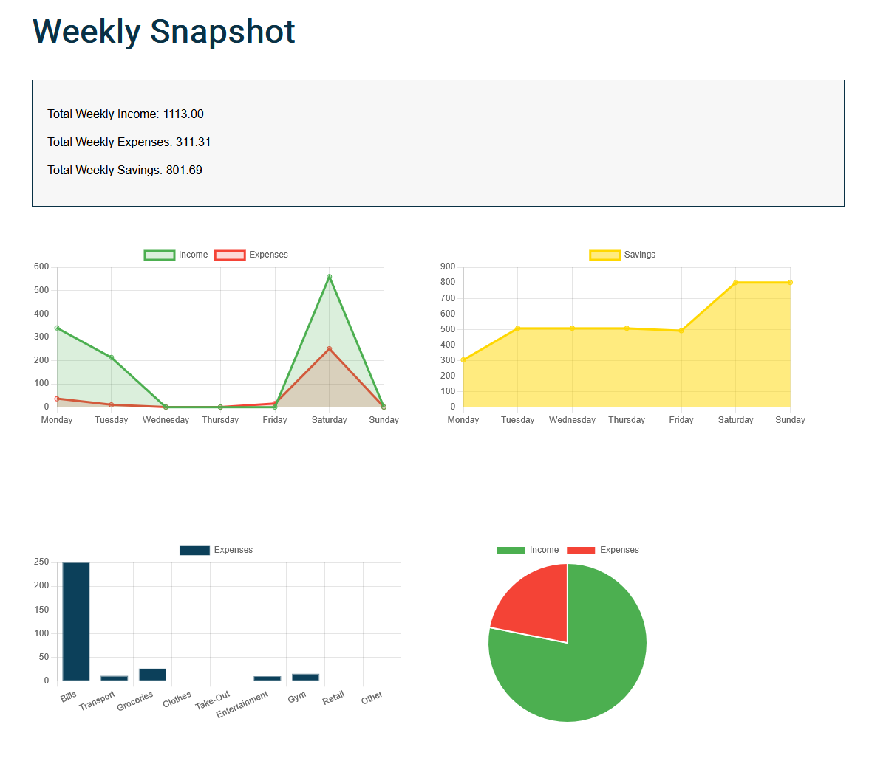
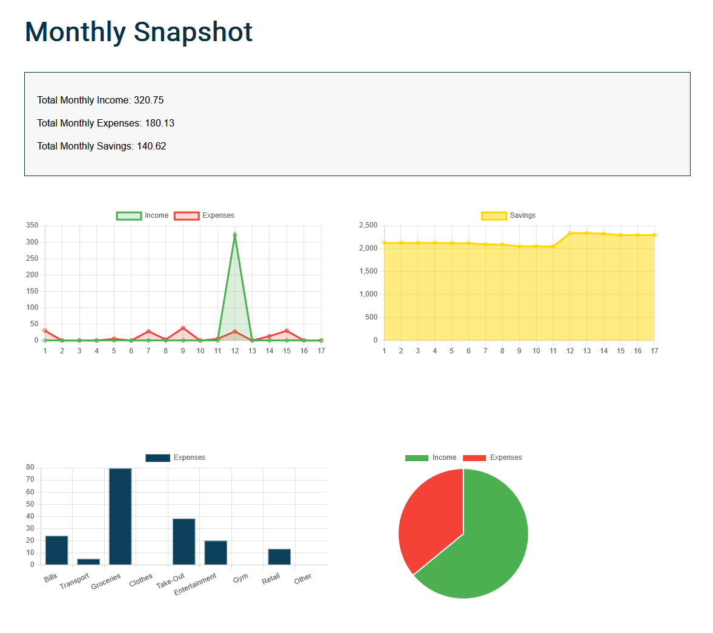
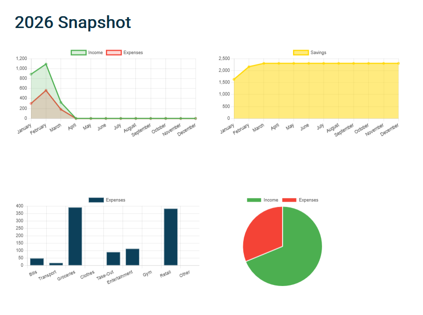
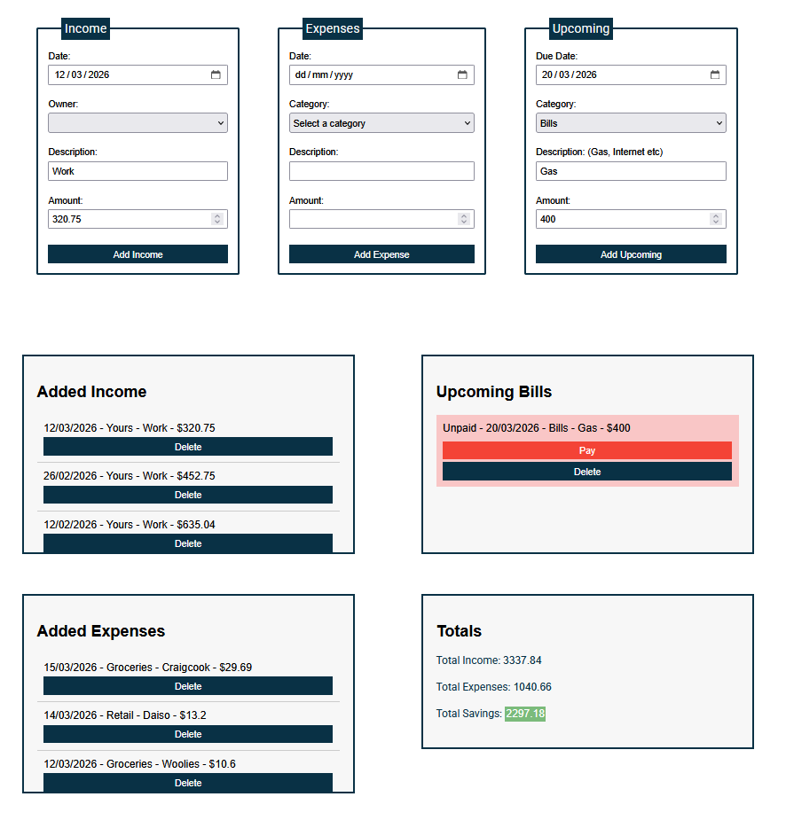

## Personal Finance Dashboard
  
[View site here](https://c-kendrick.github.io/finance-tool/)  

## Overview
A lightweight, offline-first financial dashboard built entirely with vanilla JavaScript. The application processes and visualises user metrics without requiring backend computation, ensuring zero-latency data persistence and absolute data privacy.

## Core Features
* **Dashboard Analytics:** Visualises income, expenses, and savings via dynamic, interactive charts.
* **Transaction Management:** Allows users to log, categorise, and delete daily transactions, with automatic recalculations of running totals.
* **Persistent Local State:** Secures user data across sessions without requiring an account or external database.

## Technologies Used

### Vanilla JavaScript (ES6)
The core logic and state management are built entirely in vanilla ES6 JavaScript, intentionally bypassing heavy front-end frameworks.
* **Why I chose it:** For a lightweight dashboard focused on DOM manipulation and data processing, a large framework introduces unnecessary overhead. Vanilla JS keeps the codebase maintainable, ensures zero build-step bloat (no Webpack or Babel configurations), and delivers exceptionally fast loading times.

### Chart.js
Integrated to translate raw financial data into readable, responsive metrics.
* **Why I chose it:** It is a robust, canvas-based library that streamlines responsive data visualisation. It allowed me to efficiently implement dynamic Pie charts (Income vs. Expenses), Line charts (daily savings trends), and Bar charts (expense categorisation). Leveraging an established library meant I could focus my time on the core data logic rather than custom canvas rendering.

### LocalStorage API
The application utilises the browser's native localStorage API for client-side data management.
* **Why I chose it:** I set out to build a strictly "local-first" application. By storing all financial data directly in the browser, the app guarantees absolute data privacy—the user's metrics never leave their machine. This approach demonstrates how to manage persistent state without relying on backend databases or complex authentication loops.

## Technical Architecture & State Management
Currently, the application calculates totals, updates charts, and saves data by reading values directly from the DOM elements (e.g., parsing `li.textContent`). While functional for the initial build, this tightly couples the data logic to the user interface. 

To improve resilience and scalability, the next major iteration will decouple the data model from the view layer, moving towards a strict State-Driven UI pattern.

## Roadmap & Future Iterations

* **Architectural Refactor (State-Driven UI):** Transition the application state away from the DOM. All transactions will be stored in a centralised JavaScript array in memory. The UI will become purely a reflection of this state, and functions will calculate totals directly from the data objects rather than parsing HTML text. This will eliminate string-splitting vulnerabilities and drastically improve data integrity.
* **Data Export:** Implement a feature allowing users to export their localStorage data to a CSV file for personal backups and external spreadsheet analysis.
* **Currency Localisation:** Add a global toggle to dynamically format monetary values based on regional currency standards (e.g., GBP, AUD, USD).

